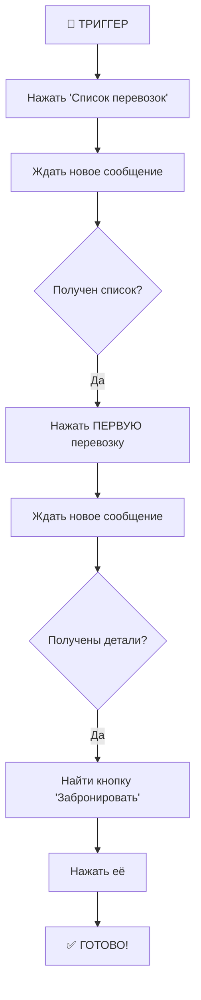

# 🧠 ЛОГИКА АВТОМАТИЗАЦИИ - КРАТКАЯ ВЕРСИЯ

## 📊 ПОСЛЕДОВАТЕЛЬНОСТЬ ДЕЙСТВИЙ

```
1️⃣ ЗАПУСК БОТА
   ↓
   • Подключается к Telegram
   • Находит @ACarriers_bot
   • Начинает слушать ВСЕ сообщения от этого бота
   
2️⃣ КАЖДОЕ СООБЩЕНИЕ ОТ БОТА
   ↓
   • Сохраняет клавиатуру (если есть)
   • Проверяет текст на триггер
   
3️⃣ ЕСЛИ НАЙДЕН ТРИГГЕР "Появились новые перевозки"
   ↓
   • СТРАТЕГИЯ "first": Нажимает ПЕРВУЮ кнопку
   • СТРАТЕГИЯ "custom": Ищет по ключевым словам
   • СТРАТЕГИЯ "all": Нажимает ВСЕ кнопки
   
4️⃣ STATE MACHINE (автоматическая цепочка)
   ↓
   [Шаг 1] Нажать "Список перевозок"
      ↓
   [Шаг 2] Выбрать первую перевозку из списка
      ↓
   [Шаг 3] Нажать "Забронировать"
      ↓
   ✅ ГОТОВО!
```

## 🎯 3 СТРАТЕГИИ ВЫБОРА КНОПОК

### 1. **"first"** (по умолчанию) ⭐
**Логика:** Берет ПЕРВУЮ кнопку в клавиатуре

```
Ряд 1: [🔔 Список прямых] ← НАЖМЁТ ЭТУ
Ряд 2: [📋 Магистральные]
Ряд 3: [📋 Мои перевозки]
```

**Когда использовать:** Когда нужная кнопка всегда первая

---

### 2. **"custom"** (по ключевым словам)
**Логика:** Ищет кнопку, содержащую ключевое слово

```python
# В config.py:
'BUTTON_KEYWORDS': ['магистральн']

# Результат:
Ряд 1: [🔔 Список прямых]
Ряд 2: [📋 Магистральные] ← НАЖМЁТ ЭТУ (есть "магистральн")
Ряд 3: [📋 Мои перевозки]
```

**Когда использовать:** Когда нужно выбрать конкретную кнопку

---

### 3. **"all"** (все подряд)
**Логика:** Нажимает ВСЕ кнопки по очереди

```
1. Нажать [🔔 Список прямых]
   ⏱️ пауза 0.05-0.15с
2. Нажать [📋 Магистральные]
   ⏱️ пауза 0.05-0.15с
3. Нажать [📋 Мои перевозки]
```

**Когда использовать:** Когда нужно проверить все варианты

---

## 🤖 МНОГОШАГОВАЯ АВТОМАТИЗАЦИЯ

После нажатия первой кнопки запускается **автоматическая цепочка**:



**Состояния (State Machine):**
- `None` - Ждем триггера
- `waiting_list` - Ждем список перевозок
- `waiting_details` - Ждем детали перевозки

---

## 🔍 КАК БОТ ВЫБИРАЕТ КНОПКУ?

### СТРАТЕГИЯ "first":
```python
# Псевдокод:
for ряд in клавиатура:
    for кнопка in ряд:
        if кнопка.тип == callback:
            НАЖАТЬ(кнопка)
            return  # Выход после первого нажатия
```

### СТРАТЕГИЯ "custom":
```python
# Псевдокод:
ключевые_слова = ['магистральн', 'магистраль']

for ряд in клавиатура:
    for кнопка in ряд:
        for слово in ключевые_слова:
            if слово in кнопка.текст.lowercase():
                НАЖАТЬ(кнопка)
                return  # Нашли!

# Если не нашли - нажимаем первую
```

### СТРАТЕГИЯ "all":
```python
# Псевдокод:
for ряд in клавиатура:
    for кнопка in ряд:
        if кнопка.тип == callback:
            НАЖАТЬ(кнопка)
            ЖДАТЬ(0.05-0.15 секунд)
```

---

## 📝 ПРИМЕРЫ КОНФИГУРАЦИИ

### Нажимать только "Прямые перевозки"
```python
# config.py
'BUTTON_STRATEGY': 'first'  # Первая кнопка - это "Прямые"
```

### Нажимать только "Магистральные"
```python
# config.py
'BUTTON_STRATEGY': 'custom'
'BUTTON_KEYWORDS': ['магистральн']
```

### Нажимать и "Прямые", и "Магистральные"
```python
# config.py
'BUTTON_STRATEGY': 'all'  # Нажмёт все кнопки
```

---

## ⚡ СКОРОСТЬ РАБОТЫ

```
Обнаружение триггера:       ~0.001с (мгновенно)
Нажатие кнопки:              ~0.05-0.15с (сетевой запрос)
Многошаговая автоматизация:  ~0.5-1.0с (3 нажатия)

ИТОГО: ~0.5-1.2 секунды от триггера до бронирования
```

---

## 🔧 БЫСТРАЯ НАСТРОЙКА

### Изменить триггер:
```bash
nano /root/automation/.env
# Найти: TRIGGER_MESSAGE=...
# Изменить на нужный текст
```

### Изменить стратегию:
```bash
nano /root/automation/config.py
# Найти: 'BUTTON_STRATEGY': 'first'
# Изменить на: 'custom' или 'all'
```

### Перезапустить:
```bash
cd /root/automation
./stop_automation.sh
./start_automation.sh
```

---

## ❓ ЧАСТЫЕ ВОПРОСЫ

**Q: Как узнать, какие кнопки видит бот?**
```bash
tail -f /root/automation/automation.log | grep "Ряд"
# Увидите: Ряд 1: ['🔔 Список прямых перевозок']
```

**Q: Бот не нажимает нужную кнопку?**
- Для 2-й или 3-й кнопки → используйте стратегию `'custom'`
- Добавьте ключевое слово из названия кнопки

**Q: Как сделать, чтобы бот нажимал вторую кнопку?**
```python
# В config.py:
'BUTTON_STRATEGY': 'custom'
'BUTTON_KEYWORDS': ['магистральн']  # или другое слово из 2-й кнопки
```

**Q: Можно ли отключить многошаговую автоматизацию?**
Да, в config.py:
```python
'MULTI_STEP_ENABLED': False
```

---

## 📊 ПОЛНАЯ ДОКУМЕНТАЦИЯ

Читайте полную версию:
```bash
ssh root@72.56.76.248
cat /root/automation/LOGIC_EXPLANATION.md
```
